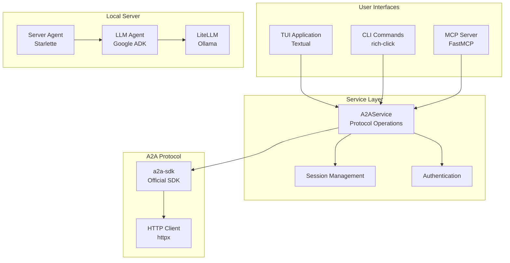

Handler is built as a multi-interface A2A protocol client with a clean separation of concerns. The architecture supports multiple interaction modes (TUI, CLI, MCP) while sharing a common service layer.

## Overview



## Core Components

### A2AService

Location: `src/a2a_handler/service.py`

The `A2AService` class is the heart of Handler's architecture. It provides a unified interface for all A2A protocol operations, wrapping the official a2a-sdk with a simplified API designed for Handler's use cases.

**Key responsibilities:**
- Wraps the a2a-sdk `Client` with a simplified interface
- Manages agent card fetching and caching
- Handles authentication credential application
- Provides both streaming and non-streaming message sending
- Manages task operations (get, cancel, resubscribe)
- Configures push notification support
- Extracts text content from various response types

**Design pattern:**
```python
class A2AService:
    def __init__(
        self,
        http_client: httpx.AsyncClient,
        agent_url: str,
        enable_streaming: bool = True,
        push_notification_url: str | None = None,
        push_notification_token: str | None = None,
        credentials: AuthCredentials | None = None,
    ) -> None:
        # Lazy initialization - client created on first use
        self._cached_client: Client | None = None
        self._cached_agent_card: AgentCard | None = None
```

**Convenience wrappers:**
- `SendResult` - Wraps task/message responses with helper properties
- `StreamEvent` - Wraps streaming events (status, artifact, message)
- `TaskResult` - Wraps task state and details

All wrappers expose the underlying SDK types via properties while adding convenience methods like `is_complete`, `needs_input`, and `needs_auth`.

### TUI Application

Location: `src/a2a_handler/tui/`

The Terminal User Interface is built with [Textual](https://textual.textualize.io/), providing a rich interactive experience for agent communication.

**Architecture:**
```
tui/
├── app.py              # Main application and event handlers
├── app.tcss            # Textual CSS styling
└── components/         # Reusable UI components
    ├── artifacts.py    # Artifact display
    ├── auth.py         # Authentication forms
    ├── card.py         # Agent card display
    ├── contact.py      # Connection panel
    ├── input.py        # Message input
    ├── logs.py         # Debug logs
    ├── messages.py     # Message history
    └── tasks.py        # Task status display
```

**Key features:**
- Component-based architecture with custom Textual widgets
- Real-time streaming response display
- Session persistence across restarts
- Theme support (light/dark)
- Command palette integration
- Maximizable panels for focused viewing

**State management:**
```python
class HandlerTUI(App):
    def __init__(self):
        self.current_agent_card: AgentCard | None = None
        self.http_client: httpx.AsyncClient | None = None
        self.current_context_id: str | None = None
        self.current_agent_url: str | None = None
        self._agent_service: A2AService | None = None
```

The TUI maintains a single `A2AService` instance per connected agent, reusing it for all operations in that session.

### CLI Interface

Location: `src/a2a_handler/cli/`

The command-line interface uses [rich-click](https://github.com/ewels/rich-click) for beautiful, readable output.

**Command structure:**
```
cli/
├── __init__.py      # Main CLI entry point
├── auth.py          # Authentication commands
├── card.py          # Agent card commands
├── mcp.py           # MCP server commands
├── message.py       # Message send/stream commands
├── server.py        # Local server commands
├── session.py       # Session management commands
└── task.py          # Task get/cancel/resubscribe commands
```

**Design principles:**
- Each command group is a separate module
- Commands create their own `A2AService` instances
- Short-lived operations (no persistent state)
- Supports both JSON and formatted output
- Session integration for context continuity

**Example pattern:**
```python
@click.command()
@click.option("--agent", required=True)
@click.option("--message", required=True)
def send(agent: str, message: str) -> None:
    async with httpx.AsyncClient() as client:
        service = A2AService(client, agent)
        result = await service.send(message)
        click.echo(result.text)
```

### MCP Server

Location: `src/a2a_handler/mcp/server.py`

The Model Context Protocol server exposes Handler's A2A capabilities as tools that can be used by AI assistants like Claude Desktop.

**Architecture:**
- Built with [FastMCP](https://github.com/jlowin/fastmcp)
- Exposes 15+ tools for complete A2A protocol coverage
- Integrates with Handler's session management
- Supports both stdio and SSE transports

**Tool categories:**
1. **Agent Discovery** - `validate_agent_card`, `get_agent_card`
2. **Messaging** - `send_message`
3. **Task Management** - `get_task`, `cancel_task`
4. **Push Notifications** - `set_task_notification`, `get_task_notification`
5. **Session Management** - `list_sessions`, `get_session_info`, `clear_session_data`
6. **Authentication** - `set_agent_credentials`, `clear_agent_credentials`

**Service instantiation:**
Each MCP tool call creates a new `A2AService` instance with the specified configuration. This ensures clean state isolation between operations.

### Local Server Agent

Location: `src/a2a_handler/server/`

Handler includes a reference implementation of an A2A server agent for testing and development.

**Components:**

#### 1. Agent (`agent.py`)
- Built with [Google Agent Development Kit (ADK)](https://github.com/google/agent-developer-kit)
- Uses [LiteLLM](https://github.com/BerriAI/litellm) for model abstraction
- Defaults to Ollama for local inference
- Configurable via environment variables

```python
def create_llm_agent(model: str | None = None) -> Agent:
    language_model = create_language_model(model)
    return Agent(
        name="Handler",
        model=language_model,
        description="Handler's built-in assistant",
        instruction=...,
    )
```

#### 2. Application (`app.py`)
- Built with [Starlette](https://www.starlette.io/) ASGI framework
- Custom A2A implementation with full push notification support
- API key authentication middleware
- Integrates Google ADK with a2a-sdk

**Key insight:**
The `create_a2a_application` function is a custom implementation that fixes push notification support. Google ADK's built-in `to_a2a()` function doesn't properly wire up push notification stores, causing operations to fail. Handler's implementation manually constructs the request handler with all required stores.

```python
def create_a2a_application(
    agent: Agent,
    agent_card: AgentCard,
    api_key: str | None = None,
) -> Starlette:
    # Manual wiring for complete push notification support
    task_store = InMemoryTaskStore()
    push_config_store = InMemoryPushNotificationConfigStore()
    push_sender = BasePushNotificationSender(...)
    
    request_handler = DefaultRequestHandler(
        agent_executor=agent_executor,
        task_store=task_store,
        push_config_store=push_config_store,
        push_sender=push_sender,
    )
```

#### 3. Agent Card (`card.py`)
- Generates dynamic agent cards based on configuration
- Supports streaming and push notifications
- Declares skills and capabilities

## Session Management

Location: `src/a2a_handler/session.py`

Sessions persist state between Handler invocations:
- `context_id` - For conversation continuity
- `task_id` - For task operations
- `credentials` - For authenticated agents

**Storage:**
- Persisted to `~/.handler/sessions.json`
- JSON-serialized with Pydantic models
- Thread-safe with file locking

**Design:**
```python
@dataclass
class Session:
    agent_url: str
    context_id: str | None = None
    task_id: str | None = None
    credentials: AuthCredentials | None = None
```

Sessions are indexed by `agent_url`, allowing multiple concurrent conversations with different agents.

## Authentication

Location: `src/a2a_handler/auth.py`

Supports multiple authentication schemes:
- Bearer tokens (`Authorization: Bearer <token>`)
- API keys (`X-API-Key: <key>` or `Authorization: ApiKey <key>`)

**Credential storage:**
Credentials are stored as part of sessions and automatically applied to HTTP requests via the `A2AService`:

```python
def set_credentials(self, credentials: AuthCredentials) -> None:
    auth_headers = credentials.to_headers()
    self.http_client.headers.update(auth_headers)
```

## Push Notifications

Location: `src/a2a_handler/webhook.py`

Handler can receive async task updates via webhooks:

**Server:**
- Built with Starlette
- Validates authentication tokens
- Logs received notifications
- Can be extended with custom handlers

**Integration:**
The `A2AService` can configure push notifications when creating a client:

```python
service = A2AService(
    http_client,
    agent_url,
    push_notification_url="http://localhost:8765",
    push_notification_token="secret",
)
```

## Validation

Location: `src/a2a_handler/validation.py`

Agent card validation with detailed error reporting:
- Schema validation against A2A protocol spec
- Field-level error messages
- Support for both URL and file-based validation

## Design Principles

### 1. Service Layer Abstraction

All interfaces (TUI, CLI, MCP) use the same `A2AService` layer. This ensures:
- Consistent behavior across interfaces
- Single source of truth for protocol logic
- Easy testing and maintenance
- No code duplication

### 2. Lazy Initialization

`A2AService` uses lazy initialization for expensive operations:
- Agent cards are fetched once and cached
- SDK clients are created on first use
- HTTP clients are reused within a session

This improves startup time and reduces unnecessary network calls.

### 3. Type Safety

Full type hints throughout the codebase:
- Python 3.11+ with modern type syntax
- Pydantic models for data validation
- a2a-sdk types exposed through wrappers
- Type checking with `ty check`

### 4. Async-First

All I/O operations are async:
- `httpx.AsyncClient` for HTTP
- Async iterators for streaming
- `asyncio` for concurrency
- Textual's async workers for TUI

### 5. Error Handling

Graceful degradation and clear error messages:
- Exceptions bubble up with context
- Logging at appropriate levels
- User-friendly error display in TUI
- JSON error responses in CLI

## Extension Points

### Adding New CLI Commands

1. Create a new module in `cli/`
2. Define commands with rich-click
3. Use `A2AService` for protocol operations
4. Add to main CLI group in `cli/__init__.py`

### Adding New TUI Components

1. Create a new widget in `tui/components/`
2. Inherit from Textual base classes
3. Add styling to `app.tcss`
4. Compose into main app

### Adding New MCP Tools

1. Add a new `@mcp.tool()` decorated function
2. Use `A2AService` for A2A operations
3. Return JSON-serializable results
4. Document in tool docstring

### Customizing the Server Agent

1. Modify `create_llm_agent()` in `server/agent.py`
2. Update agent card in `server/card.py`
3. Add custom tools or skills
4. Configure via environment variables

## Testing Architecture

Location: `tests/`

- Unit tests with pytest
- Async tests with pytest-asyncio
- Mock HTTP responses for deterministic tests
- Integration tests against local server

## Dependencies

**Core:**
- `a2a-sdk` - Official A2A protocol implementation
- `httpx` - Async HTTP client
- `pydantic` - Data validation and serialization

**TUI:**
- `textual` - Terminal UI framework
- `textual-serve` - Web serving support

**CLI:**
- `rich-click` - Rich CLI framework
- `rich` - Terminal formatting

**Server:**
- `starlette` - ASGI web framework
- `uvicorn` - ASGI server
- `google-adk` - Google Agent Development Kit
- `litellm` - LLM provider abstraction

**MCP:**
- `mcp` - Model Context Protocol SDK
- `fastmcp` - FastMCP framework

## Configuration

Location: `src/a2a_handler/common/config.py`

**User configuration directory:**
- Linux/macOS: `~/.handler/`
- Stores: sessions, themes, logs

**Environment variables:**
- `OLLAMA_MODEL` - Default Ollama model
- `OLLAMA_API_BASE` - Ollama API endpoint
- Other LiteLLM provider configuration

## Logging

Location: `src/a2a_handler/common/logging.py`

**Levels:**
- `ERROR` (default) - Errors only
- `INFO` - Key operations
- `DEBUG` - Detailed protocol traces

**Output:**
- CLI: stderr with rich formatting
- TUI: In-app log panel
- MCP: stdio (JSON-RPC compatible)

## Next Steps

- [Contributing Guide](/development/contributing) - How to contribute to Handler
- [API Reference](/api-reference) - Detailed API documentation
- [Examples](/examples) - Code examples and recipes
